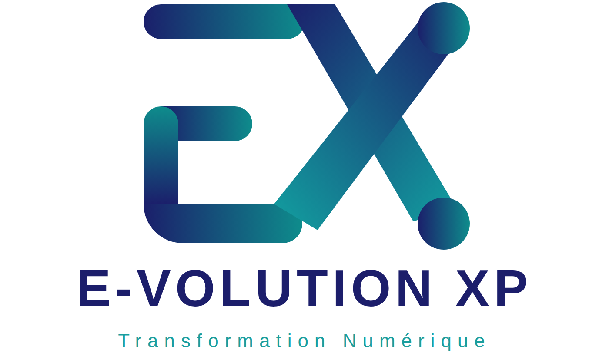

# Offre technique et financière

**Digitalisation du département Finance et de l'accompagnement des porteurs de projets**

Pour EGUITRA GROUP SARLU et MB AxisPro Consulting, à l'attention de M. Mohamed Nimaga, Directeur Général

Référence OTF-EGUITRA-2026-01, 15 septembre 2026, valable 60 jours

Émise par E-VOLUTION XP, Transformation Numérique. Contact : [Téléphone et e-mail E-VOLUTION XP]

---

_Sommaire : voir la version Word, table des matières automatique._

---

## 1. Synthèse de l'offre

EGUITRA GROUP SARLU et MB AxisPro Consulting partagent une direction générale, des locaux et deux projets de digitalisation : le département Finance d'une part, l'accompagnement des porteurs de projets d'autre part. E-VOLUTION XP présente deux propositions qui répondent toutes deux à ces deux projets, dans le même délai de 4 semaines et sur le même hébergement.

|  | Proposition 1 | Proposition 2 |
|---|---|---|
| Approche | Une plateforme unique : un noyau de gestion open source éprouvé, invisible pour les utilisateurs, et deux applications à votre image, EGUITRA Finance et AxisPro Suite. | Deux applications indépendantes développées entièrement sur mesure, EGUITRA Finance et AxisPro Suite, déployées sur un même serveur. |
| Attentes du département Finance couvertes | Vingt sur vingt | Quatorze en totalité, six en partie |
| Délai de mise en production | 4 semaines | 4 semaines |
| Investissement, hébergement de la première année compris | 92 000 000 GNF HT | 80 000 000 GNF HT |
| Hébergement, maintenance et support à partir de la deuxième année | 18 000 000 GNF HT par an | 15 000 000 GNF HT par an |
| Licences logicielles | Aucune | Aucune |
| Garantie corrective | 3 mois | 3 mois |

> Notre recommandation est la proposition 1. Pour 12 000 000 GNF de plus, le groupe obtient un noyau comptable utilisé par des dizaines de milliers d'entreprises, le multi-sociétés, le rapprochement bancaire, les circuits d'approbation à plusieurs niveaux et une évolutivité sans nouveau développement. Les deux propositions sont détaillées et chiffrées ; le choix appartient à la direction.

Validité de l'offre : 60 jours à compter du 15 septembre 2026. Tous les montants sont exprimés en francs guinéens, hors taxes.

---

## 2. Notre compréhension de votre besoin

### 2.1 Le groupe et ses activités

EGUITRA GROUP SARLU opère sur trois secteurs : le transport et la logistique de produits pétroliers, le BTP et l'immobilier, complétés par une activité de négoce. Le transport d'hydrocarbures constitue le cœur de métier, avec une flotte de quinze ensembles citernes et des clients tels que les distributeurs pétroliers et les sociétés minières. MB AxisPro Consulting, cabinet de conseil du même groupe, accompagne des porteurs de projets vers le financement bancaire et l'investissement.

Le dossier de l'exercice 2026 que vous nous avez transmis, arrêté au 15 août, donne la mesure du périmètre :

| Donnée | Volume au 15 août 2026 |
|---|---|
| Activités et centres de coût | 7 activités, 9 centres de coût |
| Comptes de trésorerie | 3 banques dont un compte USD, 2 caisses |
| Flotte et chauffeurs | 15 ensembles citernes, 15 chauffeurs, 9 routes tarifées |
| Rotations de transport enregistrées | 383 |
| Factures de vente et pièces d'achat | 147 et 169 |
| Opérations de trésorerie | 412 |
| Immobilisations et financements | 24 immobilisations, 4 emprunts et crédits-bails |
| Chiffre d'affaires cumulé | Environ 20,6 milliards GNF, dont 70 % en transport d'hydrocarbures |

### 2.2 Les deux projets

Projet 1 : la digitalisation du département Finance. Le courrier du responsable financier liste vingt attentes, de la comptabilité SYSCOHADA révisée à la rentabilité par trajet, en passant par la consolidation groupe, les workflows d'approbation, la piste d'audit et la disponibilité garantie. Le tableau du chapitre 5.1 répond point par point pour chaque proposition.

Projet 2 : la digitalisation de l'accompagnement des porteurs de projets. Le prototype MB AxisPro décrit une méthode d'évaluation de la maturité et de la bancabilité : 111 critères répartis sur 15 domaines, huit stage gates, des critères éliminatoires, une data room de 42 pièces, des revues de comité et des rapports de décision.

### 2.3 Ce que nous retenons des prototypes existants

Les deux prototypes générés par la direction constituent une spécification fonctionnelle de grande qualité. Nous les reprenons comme cahier des charges de référence dans les deux propositions, et notamment :

- Le principe de saisie unique : chaque donnée n'est saisie qu'une fois, tout le reste est calculé.
- Les règles de contrôle : équilibre débit et crédit, équilibre actif et passif, compte de passage des virements internes soldé, clôture refusée tant qu'une alerte bloquante est active.
- Les indicateurs du dirigeant : chiffre d'affaires et résultat par activité, trésorerie fin de mois, ancienneté des créances, service de la dette et DSCR, marge par rotation, écarts budgétaires.
- La méthode d'évaluation AxisPro : pondération, critères critiques et éliminatoires, gaps prioritaires, historique des revues, politique d'évaluation tracée dans chaque export.

Ces prototypes sont conçus pour un utilisateur unique, sans authentification, avec un fichier local comme seule sauvegarde. Les deux propositions conservent leurs règles et leur ergonomie, et y ajoutent ce qui manque à un outil d'entreprise : multi-utilisateurs, droits par profil, piste d'audit, sauvegardes, disponibilité et évolutivité.

---

## 3. Proposition 1 : plateforme intégrée sur noyau de gestion

### 3.1 Principe : un noyau invisible, des applications à votre image

La plateforme repose sur deux couches strictement séparées.

Le noyau de gestion est Odoo Community, complété par les modules de l'Odoo Community Association (OCA) et par nos modules spécifiques. Il assure la tenue des écritures, la cohérence comptable, le multi-sociétés, le multi-devises, les droits d'accès et la traçabilité. Il est publié sous licence libre : aucune redevance, aucune limite de nombre d'utilisateurs, aucun éditeur à contacter pour une évolution.

Les applications métier sont développées sur mesure et constituent la seule interface utilisée par vos équipes : EGUITRA Finance pour le groupe, AxisPro Suite pour le cabinet. Elles reprennent votre identité visuelle, votre vocabulaire et vos parcours de saisie. Le client web du noyau n'est jamais exposé aux utilisateurs ; il reste accessible à la seule équipe technique de E-VOLUTION XP, sur un accès réseau restreint. Cette approche est celle que nous avons mise en œuvre pour SOGUIPREM.

> Pour vos utilisateurs, il n'existe qu'EGUITRA Finance et AxisPro Suite. Le noyau reste un composant technique, au même titre que la base de données.

### 3.2 Architecture

| Couche | Composants | Rôle |
|---|---|---|
| Interface utilisateur | Applications web EGUITRA Finance et AxisPro Suite, application mobile de saisie des rotations, portail des porteurs de projets | Seule surface visible. Charte graphique du groupe, navigation métier, tableaux de bord, saisie guidée, exports. |
| API métier | Modules spécifiques exposant une API sécurisée, authentification par jeton, double authentification | Traduit les actions métier en opérations du noyau, applique les règles de gestion, journalise. |
| Noyau de gestion | Odoo Community, modules OCA, modules spécifiques du groupe | Comptabilité, analytique, trésorerie, immobilisations, budget, workflows, droits, audit. |
| Données et documents | PostgreSQL, stockage de fichiers | Persistance, pièces justificatives, data room. |
| Exploitation | VPS, conteneurs, proxy TLS, supervision, sauvegardes chiffrées hors site | Disponibilité, sécurité, restauration. |

### 3.3 EGUITRA Finance : les écrans

| Écran | Contenu |
|---|---|
| Tableau de bord du dirigeant | CA facturé, résultat, trésorerie fin de mois, encours clients, service de la dette, alertes actives, questions du dirigeant. |
| Pilotage par activité | Répartition du CA, marge et charges par activité et par centre de coût, comparaison budget. |
| Ventes | Factures de vente, avoirs, litiges, échéances, relances. |
| Achats et dépenses | Pièces d'achat par catégorie, TVA récupérable, justificatifs, circuit d'approbation. |
| Trésorerie | Encaissements, paiements, virements internes, position par compte et devise, rapprochement bancaire. |
| Tiers | Clients et fournisseurs, conditions, limites de crédit, ancienneté des créances et des dettes. |
| Immobilisations | Registre, amortissements, dotations mensuelles, cessions. |
| Journaux et OD | Journaux de ventes, achats, banque, caisse, OD ; saisie d'OD guidée. |
| Balance et grand livre | Balance générale, grand livre par compte et par tiers, filtres par période et par activité. |
| Budget face au réalisé | Lignes budgétaires mensuelles, écarts, seuils. |
| Dette et financement | Emprunts et crédits-bails, échéanciers, DSCR. |
| Alertes de gestion | Seuils de trésorerie, marge transport, écarts budgétaires, délais de recouvrement. |
| Clôtures | Clôture mensuelle avec contrôles bloquants, registre des clôtures, réouverture contrôlée. |
| Contrôles d'intégrité | Équilibres, compte de passage, cohérence des références, empreinte des écritures. |
| États financiers | Bilan, compte de résultat, tableau des flux au format SYSCOHADA, rapport mensuel de gestion. |
| Approbations | Corbeille des engagements et paiements à valider par niveau. |
| Exports | CSV et XLSX de tous les journaux et états, export d'audit. |
| Paramètres et utilisateurs | Référentiels, seuils, taux de change, profils et droits. |

S'y ajoutent les écrans métier : Flotte, Chauffeurs, Routes et tarifs, Rotations, Rentabilité par ensemble routier, Chantiers, Situations d'avancement, Retenues de garantie, Biens, Baux, Quittancement, Patrimoine, Déclarations fiscales, Consolidation groupe et Passerelle IFRS.

### 3.4 Transport pétrolier : la rotation comme source unique

Une rotation est saisie une seule fois, depuis le bureau ou depuis l'application mobile au parc, y compris sans connexion : la saisie est mise en file et synchronisée dès que le réseau revient. Chaque rotation porte le camion, le chauffeur, le client, le produit, le volume, la route, le tarif, le carburant, les péages, les frais de chauffeur, la maintenance et les taxes spécifiques. Le noyau en déduit la ligne de facturation, les coûts analytiques par véhicule et par route, et la marge. Le seuil de marge transport du dossier devient une alerte automatique.

### 3.5 AxisPro Suite

AxisPro Suite industrialise la méthode du prototype MB AxisPro dans un outil multi-utilisateurs, avec un portail pour les porteurs de projets. La grille d'évaluation est importée comme données et reste modifiable par le cabinet, sans intervention technique.

| Écran | Contenu |
|---|---|
| Portefeuille de dossiers | Liste des projets par gate, secteur, promoteur, score et décision. |
| Fiche projet | Identification, promoteur, localisation, capacité, calendrier, hypothèses de décision. |
| Saisie guidée par gate | Critères du gate courant, statut, preuve jointe, commentaire. |
| Score et knock-outs | Score par domaine, critères éliminatoires actifs, recommandation GO, NO-GO ou conditionnel. |
| Gaps prioritaires | Classement selon poids, criticité et knock-out ; les cinq actions à mener. |
| Data room | Index des pièces standard, disponibilité, versions, accès promoteur. |
| Revues de comité | Enregistrement d'une revue, historique, comparaison entre deux revues, verrouillage. |
| Rapports | Rapport de décision pour le comité, liste des pièces à fournir pour le promoteur, export XLSX. |
| Politique d'évaluation | Réglages de pondération et de seuils, versionnés et rappelés dans chaque rapport. |
| Portail du porteur de projet | Dépôt des pièces, avancement du dossier, échanges avec le cabinet. |

Le cabinet dispose en outre, dans la même plateforme et sans coût supplémentaire, de la facturation de ses prestations et du suivi de ses temps par dossier.

### 3.6 Modules communautaires retenus

| Besoin | Module OCA |
|---|---|
| Rapprochement bancaire | account_reconcile_oca, account_statement_import_file |
| Immobilisations | account_asset_management |
| Budgets et états de gestion | mis_builder, mis_builder_budget |
| États financiers et grand livre | account_financial_report |
| Workflows d'approbation | base_tier_validation, purchase_tier_validation, account_move_tier_validation |
| Piste d'audit | auditlog |
| Contrats récurrents, loyers | contract |
| Taux de change | currency_rate_update |
| Gestion documentaire | dms |

La liste définitive est arrêtée en semaine 1, module par module. Les besoins non couverts par un module communautaire sont réalisés en spécifique, sans surcoût par rapport à la présente offre.

---

## 4. Proposition 2 : deux applications indépendantes

### 4.1 Principe

Deux applications web distinctes sont développées entièrement sur mesure par E-VOLUTION XP, chacune avec sa base de données, ses utilisateurs et ses droits. Elles sont déployées sur le même VPS, derrière le même proxy sécurisé, et partagent les mêmes mécanismes de sauvegarde et de supervision. Il n'y a pas de noyau de gestion tiers : chaque fonction est écrite pour vous, à partir des prototypes de la direction.

### 4.2 Application EGUITRA Finance

L'application reprend le moteur comptable du prototype de la direction et le transpose en application multi-utilisateurs :

- Référentiels : plan de comptes SYSCOHADA, activités, centres de coût, tiers, devises, catégories de dépense, types d'opération, comptes de trésorerie.
- Journaux : ventes, achats et dépenses, trésorerie, rotations de transport, immobilisations, OD. Comptes de contrepartie déduits automatiquement, TVA calculée.
- Trésorerie : position par compte et devise, virements internes par compte de passage, pointage des opérations rapprochées.
- Immobilisations : registre, dotations mensuelles générées, cessions.
- Budget : lignes mensuelles par nature, écarts face au réalisé, seuils d'alerte.
- Clôtures mensuelles : contrôles bloquants, registre, scellement du dossier par empreinte.
- États : balance, grand livre, bilan et compte de résultat SYSCOHADA, rapport mensuel de gestion, exports CSV et XLSX.
- Métiers : rentabilité par camion et par route à partir des rotations ; suivi des chantiers avec situations d'avancement et retenues de garantie ; biens, baux et loyers pour l'immobilier.
- Tableau de bord du dirigeant, alertes de gestion, dette et DSCR.
- Utilisateurs, profils, journal des modifications.

### 4.3 Application AxisPro Suite

L'application reprend le prototype MB AxisPro avec le même périmètre fonctionnel que dans la proposition 1 : portefeuille de dossiers, fiche projet, saisie guidée par gate, score et knock-outs, gaps prioritaires, data room, revues de comité, rapports PDF et XLSX, politique d'évaluation, portail des porteurs de projets.

### 4.4 Limites à connaître

Cette proposition est plus légère et moins coûteuse. Elle comporte des limites que nous préférons énoncer avant la signature :

- Le moteur comptable est développé pour vous : il n'a pas l'historique d'un noyau utilisé par des dizaines de milliers d'entreprises. La recette avec votre expert-comptable est d'autant plus importante.
- Pas de multi-sociétés ni de consolidation automatique : la vue groupe se fait par activité, dans une seule entité juridique.
- Rapprochement bancaire par pointage manuel, sans import de relevés électroniques.
- Circuit d'approbation à un seul niveau de validation.
- Chaque nouvelle fonction est un développement : l'évolutivité dépend entièrement du prestataire.

---

## 5. Comparaison et recommandation

### 5.1 Couverture des attentes du département Finance

| Attente exprimée | Proposition 1 | Proposition 2 |
|---|---|---|
| Visibilité globale et temps réel sur CA, résultat, trésorerie, indicateurs | Couverte | Couverte |
| Vue consolidée du groupe, décomposable par activité, filiale, projet, ligne logistique | Couverte, multi-sociétés natif | Partielle : par activité, une seule société |
| Comptabilité générale SYSCOHADA révisé | Couverte, plan de comptes du noyau | Couverte, moteur développé pour vous |
| Comptabilité analytique par centre de coût, projet, chantier, activité | Couverte, plans analytiques multi-axes | Couverte |
| Trésorerie et rapprochement bancaire | Couverte, import des relevés | Partielle : pointage manuel |
| Immobilisations et amortissements | Couverte | Couverte |
| Gestion budgétaire, écarts réalisé et prévisionnel | Couverte | Couverte |
| Facturation client et fournisseur | Couverte, avec relances | Couverte, sans relances automatiques |
| Gestion fiscale, TVA, déclarations locales | Couverte | Partielle : TVA ; déclarations en option |
| Workflow d'approbation des engagements et paiements | Couverte, plusieurs niveaux et seuils | Partielle : un niveau |
| Coûts et rentabilité par trajet et véhicule, volumes, taxes spécifiques | Couverte | Couverte |
| Chantiers, facturation à l'avancement, retenues de garantie | Couverte | Couverte |
| Gestion locative et valorisation du patrimoine | Couverte | Partielle : baux et loyers, sans quittancement automatique |
| Traçabilité complète, piste d'audit | Couverte, verrouillage par empreinte et journal d'audit | Couverte, journal des modifications et empreinte |
| Sécurisation des données et des accès par profil | Couverte | Couverte |
| Disponibilité garantie et sauvegardes | Couverte | Couverte |
| Interface simple et formation | Couverte | Couverte |
| Support réactif et accompagnement | Couverte | Couverte |
| Solution évolutive | Couverte, ajout de modules sans développement | Partielle : chaque évolution est un développement |
| Tarification claire, sans coûts cachés | Couverte | Couverte |

### 5.2 Critères de choix

| Critère | Proposition 1 | Proposition 2 |
|---|---|---|
| Investissement, première année | 92 000 000 GNF HT | 80 000 000 GNF HT |
| Coût annuel à partir de la deuxième année | 18 000 000 GNF HT | 15 000 000 GNF HT |
| Délai | 4 semaines | 4 semaines |
| Robustesse comptable | Noyau éprouvé, mis à jour par une communauté mondiale | Moteur écrit pour le groupe, éprouvé par la recette |
| Périmètre | Vingt attentes sur vingt | Quatorze complètes, six partielles |
| Évolutivité | Modules existants pour la paie, les stocks, les achats, la GMAO | Développement spécifique à chaque besoin |
| Dépendance au prestataire | Faible : code ouvert, communauté, autres intégrateurs possibles | Forte : seul le prestataire connaît le code |
| Simplicité technique | Plus de composants à exploiter | Deux applications légères |

### 5.3 Notre recommandation

Nous recommandons la proposition 1. L'écart de 12 000 000 GNF finance un noyau comptable dont la fiabilité n'a plus à être démontrée, et évite au groupe de payer, dans deux ans, le développement de fonctions que le noyau apporte déjà. La proposition 2 reste pertinente si la direction privilégie un outil minimal et un budget plus serré ; elle est présentée avec ses limites pour que la décision soit prise en connaissance de cause.

---

## 6. Hébergement, sécurité et exploitation

Ce chapitre s'applique aux deux propositions.

### 6.1 Infrastructure

- Hébergement sur serveur virtuel privé dédié au groupe : VPS 4 vCPU, 8 Go de mémoire, 160 Go de disque NVMe, adresse IP dédiée, nom de domaine, stockage de sauvegarde hors site.
- Déploiement en conteneurs, proxy avec certificats TLS renouvelés automatiquement, base de données dédiée.
- Deux environnements : production et recette. Chaque évolution passe en recette avant la production.
- Nom de domaine du groupe pour chaque application, par exemple finance.eguitragroup.com et axispro.mbaxisproconsulting.com.

### 6.2 Sauvegardes et continuité

| Mesure | Engagement |
|---|---|
| Sauvegarde complète | Quotidienne, chiffrée, copiée hors site chez un second fournisseur |
| Rétention | 30 sauvegardes quotidiennes, 12 sauvegardes mensuelles |
| Perte de données maximale | 24 heures |
| Délai de reprise | 4 heures ouvrées après déclaration de sinistre |
| Test de restauration | Chaque trimestre, avec compte rendu remis au client |
| Disponibilité cible | 99,5 % par mois, hors fenêtre de maintenance annoncée 48 heures à l'avance |

### 6.3 Sécurité

- Authentification par mot de passe robuste et double authentification pour tous les utilisateurs.
- Droits par profil : direction, finance, exploitation transport, chantiers, immobilier, cabinet, porteur de projet. Chaque profil ne voit que son périmètre.
- Piste d'audit : chaque création, modification et suppression est journalisée avec l'utilisateur, la date et les valeurs avant et après.
- Écritures comptables verrouillées après clôture, avec empreinte de chaînage.
- Chiffrement des échanges et des sauvegardes, journaux d'accès conservés 12 mois.
- Mises à jour de sécurité appliquées chaque mois en recette puis en production.

### 6.4 Réversibilité

Le client est propriétaire de ses données. À tout moment, sur simple demande, nous remettons une copie complète de la base, des pièces jointes et du code développé pour lui, dans des formats ouverts, avec la documentation d'installation.

---

## 7. Démarche et planning en quatre semaines

### 7.1 Planning

Les deux propositions sont réalisées en 4 semaines à compter de la commande, par une équipe dédiée à temps plein. Ce délai repose sur trois conditions : les prototypes de la direction servent de spécification, les composants d'interface déjà développés par E-VOLUTION XP sont réutilisés, et les référents du client sont disponibles chaque semaine.

| Semaine | Objet | Travaux | Jalon |
|---|---|---|---|
| Semaine 1 | Cadrage et socle | Ateliers de cadrage avec la finance, l'exploitation, les chantiers, l'immobilier et le cabinet. Charte graphique validée. VPS en ligne, socle installé, comptes utilisateurs créés. | Dossier de conception signé, plateforme accessible |
| Semaine 2 | Finance et AxisPro | Paramétrage SYSCOHADA, axes analytiques, trésorerie, immobilisations, budget, approbations. Écrans EGUITRA Finance. Grille AxisPro importée et modèle de scoring en place. Reprise des référentiels et des soldes d'ouverture. | Écrans finance en recette interne |
| Semaine 3 | Métiers et portail | Rotations, flotte, rentabilité, application mobile. Chantiers, retenues de garantie. Biens et baux. Déclarations fiscales. Écrans AxisPro Suite et portail des porteurs. Fin de la reprise des écritures 2026. | Périmètre complet livré en recette |
| Semaine 4 | Recette et mise en production | Recette avec vos équipes sur vos données, corrections, formation par profil, mise en production, exercice 2026 consultable et exercice 2027 prêt à l'ouverture. | Procès-verbal de mise en production |

À l'issue de la semaine 4, E-VOLUTION XP assure quatre semaines d'accompagnement renforcé sur site et à distance, puis la garantie corrective de 3 mois.

### 7.2 Reprise des données

Le dossier 2026 est repris intégralement : référentiels, tiers, plan de comptes, immobilisations, financements, budget, ventes, achats, trésorerie, rotations et OD. Les balances obtenues sont confrontées au classeur d'origine et validées par votre responsable financier avant la mise en production. L'exercice 2026 est ainsi consultable dans l'outil dès le premier jour, et l'exercice 2027 s'ouvre directement dans l'outil.

### 7.3 Recette et formation

- Cahier de recette rédigé avec vos équipes en semaine 3, recette en semaine 4 sur vos données.
- Formation par profil : direction, finance, exploitation, chantiers, immobilier, cabinet. Supports et guides utilisateur remis en français.
- Accompagnement renforcé pendant les quatre semaines suivant la mise en production.

### 7.4 Gouvernance

- Un comité de pilotage hebdomadaire avec la direction générale et le responsable financier.
- Un point d'avancement quotidien de quinze minutes avec le référent du client.
- Un espace partagé de suivi des demandes, accessible au client.

### 7.5 Équipe E-VOLUTION XP

| Rôle | Mission |
|---|---|
| Directeur de projet et architecte | Interlocuteur unique, conception, arbitrages, qualité des livraisons. |
| Consultant fonctionnel finance | Paramétrage SYSCOHADA, analytique, états financiers, reprise des données, formation. |
| Développeurs | Noyau et API dans la proposition 1, moteur comptable dans la proposition 2 ; applications EGUITRA Finance et AxisPro Suite, application mobile, portail. |
| Ingénieur exploitation | VPS, sécurité, sauvegardes, supervision, support. |
| Expert-comptable partenaire | Validation du plan de comptes, des états financiers et des déclarations fiscales guinéennes. |

### 7.6 Prérequis côté client

- Un référent par domaine disponible une demi-journée par jour pendant les quatre semaines.
- La charte graphique du groupe et du cabinet, ou un atelier de définition en semaine 1.
- Les relevés bancaires et les modèles de déclarations fiscales en vigueur.
- La validation du plan de comptes par votre expert-comptable en semaine 2.

---

## 8. Offre financière

### 8.1 Hypothèses

- Tous les montants sont en francs guinéens, hors taxes. La TVA et les retenues applicables en Guinée sont ajoutées selon la réglementation en vigueur.
- Prix forfaitaires : le montant de chaque proposition est ferme pour le périmètre décrit. Toute évolution de périmètre fait l'objet d'un avenant chiffré.
- Aucun coût de licence dans les deux propositions.
- L'hébergement de la première année est compris dans le montant de chaque proposition.

### 8.2 Proposition 1 : Plateforme intégrée EGUITRA Finance et AxisPro Suite sur noyau de gestion

| Poste | Montant HT | Part |
|---|---|---|
| Cadrage, conception et charte graphique des applications | 6 000 000 GNF | 7 % |
| Socle technique : VPS, installation du noyau et des modules communautaires, sécurité, sauvegardes, supervision | 8 000 000 GNF | 9 % |
| EGUITRA Finance : paramétrage SYSCOHADA, analytique, trésorerie et rapprochement, immobilisations, budget, approbations, états financiers, 18 écrans | 32 000 000 GNF | 35 % |
| Transport pétrolier et BTP : rotations, flotte, rentabilité par camion et par route, application mobile, chantiers, retenues de garantie | 14 000 000 GNF | 15 % |
| Immobilier, fiscalité guinéenne, consolidation groupe, passerelle IFRS | 8 000 000 GNF | 9 % |
| AxisPro Suite : grille de critères, stage gates, scoring, data room, revues de comité, rapports, portail des porteurs | 14 000 000 GNF | 15 % |
| Reprise du dossier 2026, recette, formation, mise en production | 6 000 000 GNF | 7 % |
| Hébergement VPS, nom de domaine et sauvegardes hors site pendant 12 mois | 4 000 000 GNF | 4 % |
| **Total proposition 1** | **92 000 000 GNF** | **100 %** |

### 8.3 Proposition 2 : Deux applications indépendantes, EGUITRA Finance et AxisPro Suite, sur un VPS commun

| Poste | Montant HT | Part |
|---|---|---|
| Cadrage, conception et charte graphique des applications | 5 000 000 GNF | 6 % |
| Socle technique commun : VPS, base de données, authentification, sauvegardes, supervision | 7 000 000 GNF | 9 % |
| Application EGUITRA Finance : moteur comptable SYSCOHADA, ventes, achats, trésorerie, immobilisations, budget, clôtures, états, rotations transport, chantiers, gestion locative | 42 000 000 GNF | 53 % |
| Application AxisPro Suite : grille de critères, stage gates, scoring, data room, revues de comité, rapports, portail des porteurs | 18 000 000 GNF | 23 % |
| Reprise du dossier 2026, recette, formation, mise en production | 4 000 000 GNF | 5 % |
| Hébergement VPS, nom de domaine et sauvegardes hors site pendant 12 mois | 4 000 000 GNF | 5 % |
| **Total proposition 2** | **80 000 000 GNF** | **100 %** |

### 8.4 Hébergement, maintenance et support à partir de la deuxième année

La première année d'hébergement est comprise dans chaque proposition. À partir de la deuxième année, un forfait annuel unique couvre :

| Prestation | Détail |
|---|---|
| Hébergement | VPS 4 vCPU, 8 Go de mémoire, 160 Go de disque NVMe, adresse IP dédiée, nom de domaine, stockage de sauvegarde hors site |
| Exploitation | Supervision, sauvegardes, tests de restauration, mises à jour de sécurité, renouvellement des certificats |
| Support | Assistance des utilisateurs du lundi au vendredi, de 8 h à 18 h, par messagerie, e-mail et téléphone |
| Maintenance corrective | Correction de toute anomalie, sans limite |
| Maintenance évolutive | Deux jours par mois de petites évolutions, cumulables sur le trimestre |
| **Forfait annuel, proposition 1** | **18 000 000 GNF HT, facturé par semestre d'avance** |
| **Forfait annuel, proposition 2** | **15 000 000 GNF HT, facturé par semestre d'avance** |

Délais d'intervention du support, applicables dès la mise en production :

| Gravité | Définition | Prise en charge | Résolution ou contournement |
|---|---|---|---|
| Bloquante | Application inaccessible ou saisie impossible pour tous | 2 heures ouvrées | 8 heures ouvrées |
| Majeure | Fonction essentielle indisponible pour un profil | 4 heures ouvrées | 2 jours ouvrés |
| Mineure | Gêne sans blocage | 1 jour ouvré | Prochaine livraison planifiée |

### 8.5 Synthèse financière

|  | Proposition 1 | Proposition 2 |
|---|---|---|
| **Réalisation et hébergement, première année** | **92 000 000 GNF HT** | **80 000 000 GNF HT** |
| Hébergement, maintenance et support, par an à partir de la deuxième année | 18 000 000 GNF HT | 15 000 000 GNF HT |
| Coût cumulé sur trois ans | 128 000 000 GNF HT | 110 000 000 GNF HT |

### 8.6 Conditions de paiement

- 50 % à la commande, 30 % à la recette en semaine 4, 20 % au procès-verbal de mise en production.
- Forfait annuel d'hébergement, maintenance et support : par semestre d'avance, à compter du treizième mois.
- Règlement à 30 jours date de facture, par virement bancaire.

### 8.7 Engagements contractuels

- Garantie corrective de 3 mois après la mise en production, incluse dans le prix.
- Propriété du client sur ses données et sur le code développé pour lui ; les composants génériques d'E-VOLUTION XP restent réutilisables par E-VOLUTION XP.
- Réversibilité complète sur demande, sans frais, dans les formats ouverts décrits au chapitre 6.4.
- Confidentialité des données financières et des dossiers des porteurs de projets, y compris après la fin du contrat.
- Validité de l'offre : 60 jours à compter du 15 septembre 2026.

---

## 9. Annexes

### 9.1 Glossaire

| Terme | Définition |
|---|---|
| OCA | Odoo Community Association, association qui publie des modules libres pour le noyau de gestion. |
| SYSCOHADA | Système comptable de l'Organisation pour l'harmonisation en Afrique du droit des affaires, version révisée. |
| DSCR | Ratio de couverture du service de la dette. |
| Stage gate | Étape de décision d'un projet, avec ses règles de passage. |
| Knock-out | Critère éliminatoire imposant un NO-GO quel que soit le score. |
| VPS | Serveur virtuel privé, dédié au client chez un hébergeur. |
| TLS | Chiffrement des échanges entre le navigateur et le serveur. |

### 9.2 Signature

Pour E-VOLUTION XP :

Nom, qualité, date et signature

Pour EGUITRA GROUP SARLU et MB AxisPro Consulting, bon pour accord sur la proposition retenue :

Proposition retenue :  1    2

Nom, qualité, date, signature et cachet
