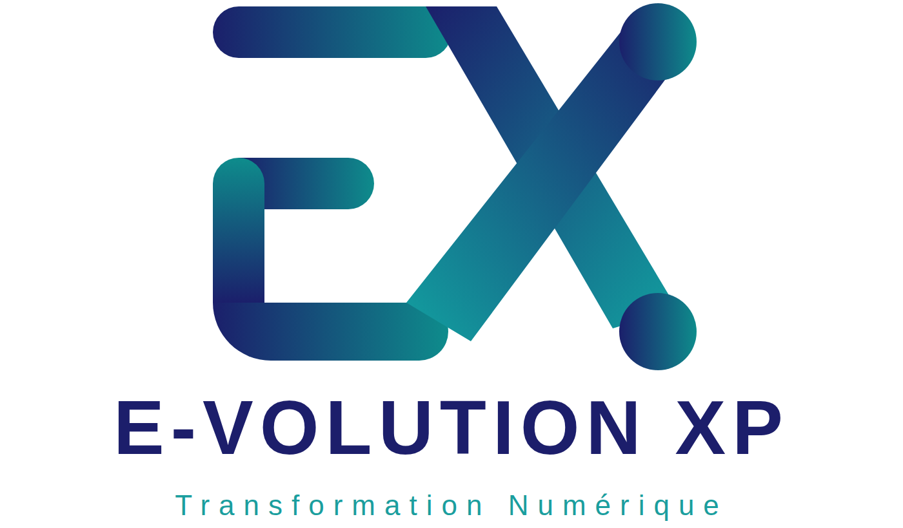

# Offre technique et financière

**Digitalisation du département Finance et de l'accompagnement des porteurs de projets**

Pour EGUITRA GROUP SARLU et MB AxisPro Consulting, à l'attention de M. Mohamed Nimaga, Directeur Général

Référence OTF-EGUITRA-2026-37, 30 septembre 2026, valable 30 jours

Émise par E-VOLUTION XP, Transformation Numérique. Contact : +224 628 86 22 55 / emkouyate@e-volutionxp.com

---

_Sommaire : voir la version Word, table des matières automatique._

---

## 1. Synthèse de l'offre

EGUITRA GROUP SARLU et MB AxisPro Consulting partagent une direction générale, des locaux et deux projets de digitalisation : le département Finance d'une part, l'accompagnement des porteurs de projets d'autre part. E-VOLUTION XP propose d'y répondre par une plateforme unique, composée d'un noyau de gestion open source éprouvé, invisible pour les utilisateurs, et de deux applications conçues à votre image : EGUITRA Finance pour le groupe et AxisPro Suite pour le cabinet.

Ce que nous proposons :

- Un noyau de gestion open source, mature, multi-sociétés et multi-devises, qui porte la comptabilité SYSCOHADA, l'analytique, la trésorerie, les immobilisations, le budget, les workflows d'approbation et la piste d'audit. Ce noyau n'a aucun coût de licence.
- Deux applications métier à votre image, seules interfaces vues par vos équipes : tableau de bord dirigeant, saisie guidée, rentabilité par camion et par route, suivi de chantiers, gestion locative, scoring de bancabilité, portail des porteurs de projets.
- Un hébergement sur serveur virtuel privé dédié, avec sauvegardes renforcées, perte de données maximale de 15 minutes, supervision et engagement de disponibilité.
- Une mise en production en 4 semaines, assortie de pénalités de retard, puis une garantie corrective de 6 mois couvrant la première clôture annuelle.

| Élément | Valeur |
|---|---|
| Attentes du département Finance couvertes | Vingt sur vingt |
| Délai de mise en production | 4 semaines à compter de la commande |
| Investissement, hébergement de la première année compris | 50 000 000 GNF HT |
| Hébergement, maintenance et support à partir de la deuxième année | 9 000 000 GNF HT par an |
| Licences logicielles | Aucune |
| Garantie corrective | 6 mois, première clôture annuelle couverte |
| Perte de données maximale | 15 minutes |
| Pénalités de retard | 0,5 % par jour ouvré, plafonnées à 10 % |
| Validité de l'offre | 30 jours à compter du 30 septembre 2026 |

Tous les montants sont exprimés en francs guinéens, hors taxes.

---

## 2. Notre compréhension de votre besoin

### 2.1 Le groupe et ses activités

EGUITRA GROUP SARLU est active sur trois secteurs : le transport et la logistique de produits pétroliers, le BTP et l'immobilier. Chacun a ses propres exigences de gestion : rentabilité par trajet et par véhicule, volumes et taxes spécifiques pour le transport ; facturation à l'avancement et retenues de garantie pour les chantiers ; gestion locative et valorisation du patrimoine pour l'immobilier. Le groupe recherche un progiciel de gestion financière intégré, capable de couvrir l'ensemble de ces activités avec une vue consolidée.

MB AxisPro Consulting, cabinet de conseil du même groupe, accompagne des porteurs de projets vers le financement bancaire et l'investissement, selon une méthode d'évaluation de la maturité et de la bancabilité formalisée par la direction.

### 2.2 Les deux projets

Projet 1 : la digitalisation du département Finance. Le courrier du responsable financier liste vingt attentes, de la comptabilité SYSCOHADA révisée à la rentabilité par trajet, en passant par la consolidation groupe, les workflows d'approbation, la piste d'audit, la disponibilité garantie et une tarification sans coûts cachés. Le chapitre 4 y répond point par point.

Projet 2 : la digitalisation de l'accompagnement des porteurs de projets. Le prototype MB AxisPro décrit la méthode : 111 critères répartis sur 15 domaines, huit stage gates, des critères éliminatoires, une data room de 42 pièces, des revues de comité et des rapports de décision.

### 2.3 Ce que nous retenons des prototypes existants

Les deux prototypes générés par la direction, EGUITRA Finance et MB AxisPro, constituent une spécification fonctionnelle de grande qualité. Nous les reprenons comme cahier des charges de référence, et notamment :

- Le principe de saisie unique : chaque donnée n'est saisie qu'une fois, tout le reste est calculé.
- Les règles de contrôle : équilibre débit et crédit, équilibre actif et passif, compte de passage des virements internes soldé, clôture refusée tant qu'une alerte bloquante est active.
- Les indicateurs du dirigeant : chiffre d'affaires et résultat par activité, trésorerie fin de mois, ancienneté des créances, service de la dette et DSCR, marge par rotation, écarts budgétaires.
- La méthode d'évaluation AxisPro : pondération, critères critiques et éliminatoires, gaps prioritaires, historique des revues, politique d'évaluation tracée dans chaque export.

Ces prototypes sont conçus pour un utilisateur unique, sans authentification, avec un fichier local comme seule sauvegarde. La plateforme proposée conserve leurs règles et leur ergonomie, et y ajoute ce qui manque à un outil d'entreprise : multi-utilisateurs, droits par profil, piste d'audit, sauvegardes, disponibilité et évolutivité.

---

## 3. La solution : plateforme intégrée sur noyau de gestion

### 3.1 Principe : un noyau invisible, des applications à votre image

La plateforme repose sur deux couches strictement séparées. Le noyau de gestion est Odoo Community, complété par les modules de l'Odoo Community Association (OCA) et par nos modules spécifiques. Il assure la tenue des écritures, la cohérence comptable, le multi-sociétés, le multi-devises, les droits d'accès et la traçabilité. Il est publié sous licence libre : aucune redevance, aucune limite de nombre d'utilisateurs, aucun éditeur à contacter pour une évolution.

Les applications métier sont développées sur mesure et constituent la seule interface utilisée par vos équipes : EGUITRA Finance pour le groupe, AxisPro Suite pour le cabinet. Elles reprennent votre identité visuelle, votre vocabulaire et vos parcours de saisie. Le client web du noyau n'est jamais exposé aux utilisateurs ; il reste accessible à la seule équipe technique d'E-VOLUTION XP, sur un accès réseau restreint. Cette approche est celle que nous avons mise en œuvre pour SOGUIPREM.

> Pour vos utilisateurs, il n'existe qu'EGUITRA Finance et AxisPro Suite. Le noyau reste un composant technique, au même titre que la base de données.

### 3.2 Architecture

| Couche | Composants | Rôle |
|---|---|---|
| Interface utilisateur | Applications web EGUITRA Finance et AxisPro Suite, application mobile de saisie des rotations, portail des porteurs de projets | Seule surface visible. Charte graphique du groupe, navigation métier, tableaux de bord, saisie guidée, exports. |
| API métier | Modules spécifiques exposant une API sécurisée, authentification par jeton, double authentification | Traduit les actions métier en opérations du noyau, applique les règles de gestion, journalise. |
| Noyau de gestion | Odoo Community, modules OCA, modules spécifiques du groupe | Comptabilité, analytique, trésorerie, immobilisations, budget, workflows, droits, audit. |
| Données et documents | PostgreSQL, stockage de fichiers | Persistance, pièces justificatives, data room. |
| Exploitation | VPS, conteneurs, proxy TLS, supervision, sauvegardes chiffrées hors site | Disponibilité, sécurité, restauration. |

### 3.3 EGUITRA Finance : les écrans

| Écran | Contenu |
|---|---|
| Tableau de bord du dirigeant | CA facturé, résultat, trésorerie fin de mois, encours clients, service de la dette, alertes actives, questions du dirigeant. |
| Pilotage par activité | Répartition du CA, marge et charges par activité et par centre de coût, comparaison budget. |
| Ventes | Factures de vente, avoirs, litiges, échéances, relances. |
| Achats et dépenses | Pièces d'achat par catégorie, TVA récupérable, justificatifs, circuit d'approbation. |
| Trésorerie | Encaissements, paiements, virements internes, position par compte et devise, rapprochement bancaire. |
| Tiers | Clients et fournisseurs, conditions, limites de crédit, ancienneté des créances et des dettes. |
| Immobilisations | Registre, amortissements, dotations mensuelles, cessions. |
| Journaux et OD | Journaux de ventes, achats, banque, caisse, OD ; saisie d'OD guidée. |
| Balance et grand livre | Balance générale, grand livre par compte et par tiers, filtres par période et par activité. |
| Budget face au réalisé | Lignes budgétaires mensuelles, écarts, seuils. |
| Dette et financement | Emprunts et crédits-bails, échéanciers, DSCR. |
| Alertes de gestion | Seuils de trésorerie, marge transport, écarts budgétaires, délais de recouvrement. |
| Clôtures | Clôture mensuelle avec contrôles bloquants, registre des clôtures, réouverture contrôlée. |
| Contrôles d'intégrité | Équilibres, compte de passage, cohérence des références, empreinte des écritures. |
| États financiers | Bilan, compte de résultat, tableau des flux au format SYSCOHADA, rapport mensuel de gestion. |
| Approbations | Corbeille des engagements et paiements à valider par niveau. |
| Exports | CSV et XLSX de tous les journaux et états, export d'audit. |
| Paramètres et utilisateurs | Référentiels, seuils, taux de change, profils et droits. |

S'y ajoutent les écrans métier : Flotte, Chauffeurs, Routes et tarifs, Rotations, Rentabilité par ensemble routier, Chantiers, Situations d'avancement, Retenues de garantie, Biens, Baux, Quittancement, Patrimoine, Déclarations fiscales, Consolidation groupe et Passerelle IFRS.

### 3.4 Transport pétrolier : la rotation comme source unique

Une rotation est saisie une seule fois, depuis le bureau ou depuis l'application mobile au parc, y compris sans connexion : la saisie est mise en file et synchronisée dès que le réseau revient. Chaque rotation porte le camion, le chauffeur, le client, le produit, le volume, la route, le tarif, le carburant, les péages, les frais de chauffeur, la maintenance et les taxes spécifiques. Le noyau en déduit la ligne de facturation, les coûts analytiques par véhicule et par route, et la marge. Le seuil de marge que vous fixez devient une alerte automatique.

### 3.5 AxisPro Suite

AxisPro Suite industrialise la méthode du prototype MB AxisPro dans un outil multi-utilisateurs, avec un portail pour les porteurs de projets. La grille d'évaluation est importée comme données et reste modifiable par le cabinet, sans intervention technique.

| Écran | Contenu |
|---|---|
| Portefeuille de dossiers | Liste des projets par gate, secteur, promoteur, score et décision. |
| Fiche projet | Identification, promoteur, localisation, capacité, calendrier, hypothèses de décision. |
| Saisie guidée par gate | Critères du gate courant, statut, preuve jointe, commentaire. |
| Score et knock-outs | Score par domaine, critères éliminatoires actifs, recommandation GO, NO-GO ou conditionnel. |
| Gaps prioritaires | Classement selon poids, criticité et knock-out ; les cinq actions à mener. |
| Data room | Index des pièces standard, disponibilité, versions, accès promoteur. |
| Revues de comité | Enregistrement d'une revue, historique, comparaison entre deux revues, verrouillage. |
| Rapports | Rapport de décision pour le comité, liste des pièces à fournir pour le promoteur, export XLSX. |
| Politique d'évaluation | Réglages de pondération et de seuils, versionnés et rappelés dans chaque rapport. |
| Portail du porteur de projet | Dépôt des pièces, avancement du dossier, échanges avec le cabinet. |

Le cabinet dispose en outre, dans la même plateforme et sans coût supplémentaire, de la facturation de ses prestations et du suivi de ses temps par dossier.

### 3.6 Modules communautaires retenus

| Besoin | Module OCA |
|---|---|
| Rapprochement bancaire | account_reconcile_oca, account_statement_import_file |
| Immobilisations | account_asset_management |
| Budgets et états de gestion | mis_builder, mis_builder_budget |
| États financiers et grand livre | account_financial_report |
| Workflows d'approbation | base_tier_validation, purchase_tier_validation, account_move_tier_validation |
| Piste d'audit | auditlog |
| Contrats récurrents, loyers | contract |
| Taux de change | currency_rate_update |
| Gestion documentaire | dms |

La liste définitive est arrêtée en semaine 1, module par module. Les besoins non couverts par un module communautaire sont réalisés en spécifique, sans surcoût par rapport à la présente offre.

---

## 4. Couverture des attentes du département Finance

Chaque attente exprimée dans votre courrier est reprise ci-dessous avec la réponse apportée par la plateforme.

| Attente exprimée | Réponse |
|---|---|
| Visibilité globale et temps réel sur CA, résultat, trésorerie, indicateurs | Couverte : tableau de bord du dirigeant alimenté en direct |
| Vue consolidée du groupe, décomposable par activité, filiale, projet, ligne logistique | Couverte : multi-sociétés natif, plans analytiques multi-axes, rapports consolidés |
| Comptabilité générale SYSCOHADA révisé | Couverte : plan de comptes du noyau, validé avec votre expert-comptable |
| Comptabilité analytique par centre de coût, projet, chantier, activité | Couverte : axes Activité, Centre de coût, Chantier, Véhicule, Bien |
| Trésorerie et rapprochement bancaire | Couverte : import des relevés, rapprochement assisté |
| Immobilisations et amortissements | Couverte |
| Gestion budgétaire, écarts réalisé et prévisionnel | Couverte |
| Facturation client et fournisseur | Couverte, avec relances |
| Gestion fiscale, TVA, déclarations locales | Couverte : états de déclaration au format guinéen |
| Workflow d'approbation des engagements et paiements | Couverte : plusieurs niveaux et seuils par montant |
| Coûts et rentabilité par trajet et véhicule, volumes, taxes spécifiques | Couverte : module rotations |
| Chantiers, facturation à l'avancement, retenues de garantie | Couverte : jalons et conditions de paiement à deux échéances |
| Gestion locative et valorisation du patrimoine | Couverte : contrats récurrents, biens et baux |
| Traçabilité complète, piste d'audit | Couverte : verrouillage par empreinte, journal d'audit |
| Sécurisation des données et des accès par profil | Couverte : rôles, double authentification, chiffrement |
| Disponibilité garantie et sauvegardes | Couverte : 99,5 %, perte maximale 15 minutes |
| Interface simple et formation | Couverte : applications conçues avec vos équipes, formation par profil |
| Support réactif et accompagnement | Couverte : délais d'intervention contractuels |
| Solution évolutive | Couverte : ajout de sociétés, d'activités et de modules sans licence |
| Tarification claire, sans coûts cachés | Couverte : forfait ferme, pas de licence, forfait annuel unique |

---

## 5. Hébergement, sécurité et exploitation

### 5.1 Infrastructure

- Hébergement sur serveur virtuel privé dédié au groupe : VPS 4 vCPU, 8 Go de mémoire, 160 Go de disque NVMe, adresse IP dédiée, nom de domaine, stockage de sauvegarde hors site.
- Déploiement en conteneurs, proxy avec certificats TLS renouvelés automatiquement, base de données dédiée.
- Deux environnements : production et recette. Chaque évolution passe en recette avant la production.
- Nom de domaine du groupe pour chaque application, par exemple finance.eguitragroup.com et axispro.mbaxisproconsulting.com.

### 5.2 Sauvegardes et continuité

Un outil comptable ne tolère pas la perte d'une journée de saisie. Le dispositif de sauvegarde combine donc une sauvegarde complète quotidienne et un archivage continu des modifications, pour l'ensemble des modules et sans supplément de prix :

| Mesure | Engagement |
|---|---|
| Sauvegarde complète | Quotidienne, chiffrée, copiée hors site chez un second fournisseur |
| Archivage continu de la base | Journaux de transactions PostgreSQL archivés hors site toutes les 15 minutes ; restauration possible à tout instant entre deux sauvegardes complètes |
| Pièces jointes et documents | Synchronisation hors site toutes les heures |
| Rétention | 30 sauvegardes quotidiennes, 12 sauvegardes mensuelles, journaux de transactions conservés 30 jours |
| Perte de données maximale | 15 minutes pour la base, 1 heure pour les pièces jointes |
| Délai de reprise | 4 heures ouvrées après déclaration de sinistre |
| Test de restauration | Chaque trimestre, avec compte rendu remis au client ; le premier test est réalisé avant la mise en production |
| Disponibilité cible | 99,5 % par mois, hors fenêtre de maintenance annoncée 48 heures à l'avance |

Le stockage hors site nécessaire est compris dans l'hébergement de la première année et dans le forfait annuel. Une sauvegarde locale supplémentaire sur un serveur dans vos locaux à Conakry peut être ajoutée en option, sur devis.

### 5.3 Sécurité

- Authentification par mot de passe robuste et double authentification pour tous les utilisateurs.
- Droits par profil : direction, finance, exploitation transport, chantiers, immobilier, cabinet, porteur de projet. Chaque profil ne voit que son périmètre.
- Piste d'audit : chaque création, modification et suppression est journalisée avec l'utilisateur, la date et les valeurs avant et après.
- Écritures comptables verrouillées après clôture, avec empreinte de chaînage.
- Chiffrement des échanges et des sauvegardes, journaux d'accès conservés 12 mois.
- Mises à jour de sécurité appliquées chaque mois en recette puis en production.

### 5.4 Réversibilité

Le client est propriétaire de ses données. À tout moment, sur simple demande, nous remettons une copie complète de la base, des pièces jointes et du code développé pour lui, dans des formats ouverts, avec la documentation d'installation.

---

## 6. Démarche et planning en quatre semaines

### 6.1 Planning

La réalisation est menée en 4 semaines à compter de la date de commande, par une équipe dédiée à temps plein. Ce délai repose sur trois conditions : les prototypes de la direction servent de spécification, les composants d'interface déjà développés par E-VOLUTION XP sont réutilisés, et les référents du client sont disponibles chaque jour. La date de commande est celle de la réception du bon de commande signé et de l'acompte ; la date contractuelle de mise en production est fixée à 4 semaines calendaires après cette date et inscrite au contrat.

| Semaine | Objet | Travaux | Jalon |
|---|---|---|---|
| Semaine 1 | Cadrage et socle | Ateliers de cadrage avec la finance, l'exploitation, les chantiers, l'immobilier et le cabinet. Charte graphique validée. VPS en ligne, socle installé, comptes utilisateurs créés. | Dossier de conception signé, plateforme accessible |
| Semaine 2 | Finance et AxisPro | Paramétrage SYSCOHADA, axes analytiques, trésorerie, immobilisations, budget, approbations. Écrans EGUITRA Finance. Grille AxisPro importée et modèle de scoring en place. Reprise des référentiels et des soldes d'ouverture. | Écrans finance en recette interne |
| Semaine 3 | Métiers et portail | Rotations, flotte, rentabilité, application mobile. Chantiers, retenues de garantie. Biens et baux. Déclarations fiscales. Écrans AxisPro Suite et portail des porteurs. Fin de la reprise des écritures de l'exercice en cours. | Périmètre complet livré en recette |
| Semaine 4 | Recette et mise en production | Recette avec vos équipes sur vos données, corrections, formation par profil, mise en production, exercice en cours consultable et exercice suivant prêt à l'ouverture. | Procès-verbal de mise en production |

À l'issue de la semaine 4, E-VOLUTION XP assure quatre semaines d'accompagnement renforcé sur site et à distance, puis la garantie corrective de 6 mois décrite au chapitre 7.6.

### 6.2 Engagement de délai et pénalités de retard

- Tout retard sur la date contractuelle de mise en production imputable à E-VOLUTION XP donne lieu à une pénalité de 0,5 % du montant HT de la commande par jour ouvré de retard.
- La pénalité est plafonnée à 10 % du montant HT de la commande, soit 5 000 000 GNF. Elle est déduite de la dernière facture, sans autre formalité qu'un décompte contradictoire.
- Un retard est imputable au prestataire dès lors qu'il ne résulte pas d'une des causes suivantes : indisponibilité des référents du client aux créneaux convenus, remise tardive des éléments listés au chapitre 6.6, validation du plan de comptes par l'expert-comptable au-delà de la semaine 2, demande de modification du périmètre, cas de force majeure.
- Un retard dû à l'une de ces causes décale la date contractuelle de mise en production du même nombre de jours ouvrés, constaté par écrit au comité de pilotage hebdomadaire.
- La recette est réputée acquise si le client ne formule aucune réserve écrite dans les cinq jours ouvrés suivant la livraison en recette ; les réserves bloquantes sont levées avant la mise en production, les réserves mineures dans le cadre de la garantie.

### 6.3 Reprise des données

Les données de l'exercice en cours sont reprises à partir de vos fichiers actuels : référentiels, tiers, plan de comptes, immobilisations, financements, budget, puis les écritures de ventes, d'achats, de trésorerie, les rotations et les OD depuis l'ouverture de l'exercice. Les balances obtenues sont confrontées à vos états actuels et validées par votre responsable financier avant la mise en production. L'exercice en cours est ainsi consultable dans l'outil dès le premier jour, et l'exercice suivant s'ouvre directement dans l'outil.

### 6.4 Recette et formation

- Cahier de recette rédigé avec vos équipes en semaine 3, recette en semaine 4 sur vos données.
- Formation par profil : direction, finance, exploitation, chantiers, immobilier, cabinet. Supports et guides utilisateur remis en français.
- Accompagnement renforcé pendant les quatre semaines suivant la mise en production.

### 6.5 Gouvernance

- Un comité de pilotage hebdomadaire avec la direction générale et le responsable financier, avec compte rendu écrit constatant l'avancement et, le cas échéant, les décalages et leur cause.
- Un point d'avancement quotidien de quinze minutes avec le référent du client.
- Un espace partagé de suivi des demandes, accessible au client.

### 6.6 Prérequis côté client

- Un référent par domaine disponible une demi-journée par jour pendant les quatre semaines.
- La charte graphique du groupe et du cabinet, ou un atelier de définition en semaine 1.
- Les fichiers de gestion actuels, les relevés bancaires et les modèles de déclarations fiscales en vigueur, remis au plus tard en semaine 1.
- La validation du plan de comptes par votre expert-comptable en semaine 2.

---

## 7. Offre financière

### 7.1 Hypothèses

- Tous les montants sont en francs guinéens, hors taxes. La TVA et les retenues applicables en Guinée sont ajoutées selon la réglementation en vigueur.
- Prix forfaitaire : le montant est ferme pour le périmètre décrit. Toute évolution de périmètre fait l'objet d'un avenant chiffré.
- Aucun coût de licence.
- L'hébergement de la première année, avec le dispositif de sauvegarde renforcé, est compris dans le montant.
- La garantie corrective de 6 mois est comprise dans le montant. L'engagement de délai et les pénalités de retard qui l'accompagnent n'entraînent aucun surcoût.

### 7.2 Détail par poste

| Poste | Montant HT | Part |
|---|---|---|
| Cadrage, conception et charte graphique des applications | 3 000 000 GNF | 6 % |
| Socle technique : VPS, installation du noyau et des modules communautaires, sécurité, sauvegardes, supervision | 4 000 000 GNF | 8 % |
| EGUITRA Finance : paramétrage SYSCOHADA, analytique, trésorerie et rapprochement, immobilisations, budget, approbations, états financiers, 18 écrans | 17 000 000 GNF | 34 % |
| Transport pétrolier et BTP : rotations, flotte, rentabilité par camion et par route, application mobile, chantiers, retenues de garantie | 8 000 000 GNF | 16 % |
| Immobilier, fiscalité guinéenne, consolidation groupe, passerelle IFRS | 4 000 000 GNF | 8 % |
| AxisPro Suite : grille de critères, stage gates, scoring, data room, revues de comité, rapports, portail des porteurs | 8 000 000 GNF | 16 % |
| Reprise des données de l'exercice en cours, recette, formation, mise en production | 3 000 000 GNF | 6 % |
| Hébergement VPS, nom de domaine et sauvegardes hors site pendant 12 mois | 3 000 000 GNF | 6 % |
| **Total** | **50 000 000 GNF** | **100 %** |

### 7.3 Hébergement, maintenance et support à partir de la deuxième année

La première année d'hébergement est comprise dans le montant ci-dessus. À partir du treizième mois, un forfait annuel unique de 9 000 000 GNF HT couvre :

| Prestation | Détail |
|---|---|
| Hébergement | VPS 4 vCPU, 8 Go de mémoire, 160 Go de disque NVMe, adresse IP dédiée, nom de domaine, stockage de sauvegarde hors site |
| Exploitation | Supervision, sauvegardes renforcées du chapitre 5.2, tests de restauration, mises à jour de sécurité, renouvellement des certificats |
| Support | Assistance des utilisateurs du lundi au vendredi, de 8 h à 18 h, par messagerie, e-mail et téléphone |
| Maintenance corrective | Correction de toute anomalie, sans limite |
| Maintenance évolutive | 2 jours par mois d'évolutions incluses, cumulables sur le trimestre, selon les critères ci-dessous |
| **Forfait annuel** | **9 000 000 GNF HT, facturé par semestre d'avance** |

Une évolution est qualifiée d'incluse ou de facturable selon les critères suivants :

| Évolution incluse dans le forfait | Évolution facturable sur devis |
|---|---|
| Modification ou ajout d'un champ, d'une colonne, d'un filtre ou d'un tri sur un écran existant | Création d'un nouvel écran ou d'un nouveau parcours de saisie |
| Ajustement d'un état, d'un export ou d'un rapport existant : colonne, total, mise en page, libellé | Création d'un nouvel état, d'un nouveau rapport ou d'un nouveau module |
| Nouvelle règle d'alerte, nouveau seuil, nouveau contrôle de clôture sur les données existantes | Nouvelle intégration avec un système externe : banque, administration, logiciel tiers |
| Ajustement d'un circuit d'approbation : niveaux, seuils, approbateurs | Nouvelle société, nouvelle activité ou nouveau métier nécessitant un paramétrage complet |
| Création ou modification de profils, de droits, de référentiels, de taux, de paramètres | Modification du modèle de données : nouvel objet métier, nouvelle relation |
| Toute demande représentant au plus une journée de travail | Toute demande représentant plus d'une journée de travail |

- Chaque demande est qualifiée par écrit par E-VOLUTION XP dans les deux jours ouvrés, avec la charge estimée ; le client valide avant réalisation.
- Les jours inclus non consommés au terme d'un trimestre sont perdus. Au-delà des jours inclus, ou pour une évolution facturable, le tarif applicable est de 800 000 GNF HT par jour, sur devis accepté avant réalisation.
- Une correction d'anomalie n'est jamais décomptée de la maintenance évolutive.

Délais d'intervention du support, applicables dès la mise en production :

| Gravité | Définition | Prise en charge | Résolution ou contournement |
|---|---|---|---|
| Bloquante | Application inaccessible ou saisie impossible pour tous | 2 heures ouvrées | 8 heures ouvrées |
| Majeure | Fonction essentielle indisponible pour un profil | 4 heures ouvrées | 2 jours ouvrés |
| Mineure | Gêne sans blocage | 1 jour ouvré | Prochaine livraison planifiée |

### 7.4 Synthèse financière

| Poste | Montant HT |
|---|---|
| **Réalisation et hébergement, première année** | **50 000 000 GNF HT** |
| Hébergement, maintenance et support, par an à partir de la deuxième année | 9 000 000 GNF HT |
| Coût cumulé sur trois ans | 68 000 000 GNF HT |

### 7.5 Conditions de paiement

- 50 % à la commande, 30 % à la recette en semaine 4, 20 % au procès-verbal de mise en production, déduction faite des pénalités éventuelles.
- Forfait annuel d'hébergement, maintenance et support : par semestre d'avance, à compter du treizième mois.
- Règlement à 30 jours date de facture, par virement bancaire.

### 7.6 Engagements contractuels

- Garantie corrective de 6 mois à compter du procès-verbal de mise en production et, si cette échéance est postérieure, jusqu'à la production des états financiers annuels de l'exercice en cours et de la déclaration fiscale correspondante. Elle couvre toute anomalie de fonctionnement, y compris celles révélées par la clôture annuelle et les déclarations fiscales de fin d'exercice, sans limite d'interventions.
- Pénalités de retard imputables à E-VOLUTION XP selon le chapitre 6.2.
- Sauvegardes renforcées selon le chapitre 5.2, perte de données maximale de 15 minutes.
- Propriété du client sur ses données et sur le code développé pour lui ; les composants génériques d'E-VOLUTION XP restent réutilisables par E-VOLUTION XP.
- Réversibilité complète sur demande, sans frais, dans les formats ouverts décrits au chapitre 5.4.
- Confidentialité des données financières et des dossiers des porteurs de projets, y compris après la fin du contrat.
- Validité de l'offre : 30 jours à compter du 30 septembre 2026.

---

## 8. Annexes

### 8.1 Glossaire

| Terme | Définition |
|---|---|
| OCA | Odoo Community Association, association qui publie des modules libres pour le noyau de gestion. |
| SYSCOHADA | Système comptable de l'Organisation pour l'harmonisation en Afrique du droit des affaires, version révisée. |
| DSCR | Ratio de couverture du service de la dette. |
| OD | Opérations diverses : écritures comptables qui ne relèvent ni des ventes, ni des achats, ni de la trésorerie. |
| IFRS | Normes internationales d'information financière, utilisées par les banques et investisseurs étrangers. |
| Stage gate | Étape de décision d'un projet, avec ses règles de passage. |
| Knock-out | Critère éliminatoire imposant un NO-GO quel que soit le score. |
| VPS | Serveur virtuel privé, dédié au client chez un hébergeur. |
| TLS | Chiffrement des échanges entre le navigateur et le serveur. |
| Journal de transactions | Fichier où la base de données inscrit chaque modification avant de l'appliquer ; son archivage permet de restaurer la base à un instant précis. |

### 8.2 Signature

Pour E-volution Experience

Madigbè KOUYATÉ, Gérant

Signature : ________________

Pour EGUITRA GROUP SARLU et MB AxisPro Consulting

Date : ________________

Signature et cachet : ________________

Mention manuscrite obligatoire : « Lu et approuvé. Bon pour accord »
